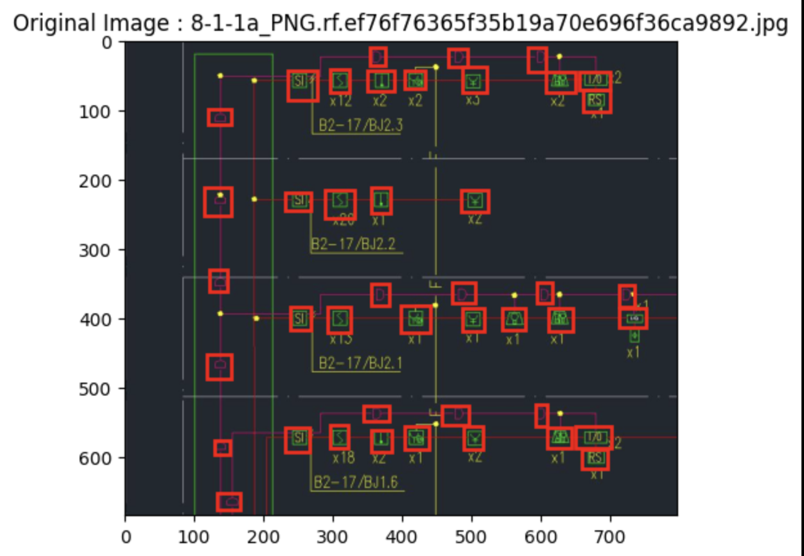
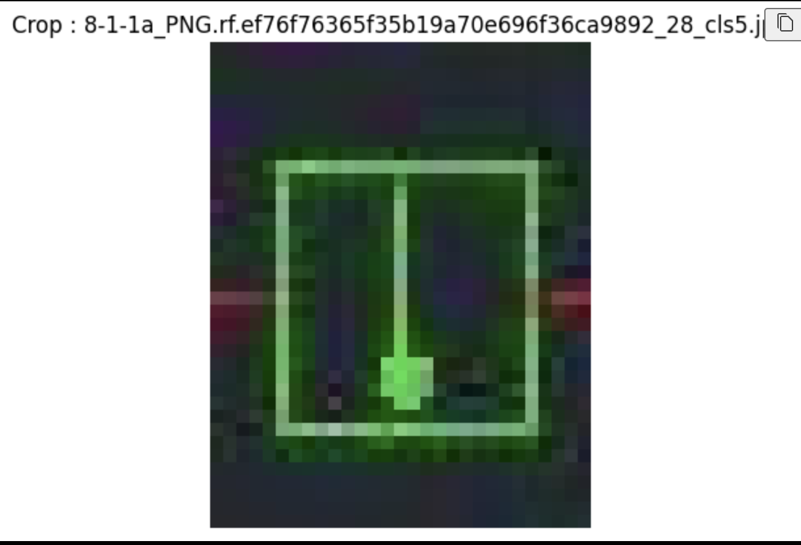
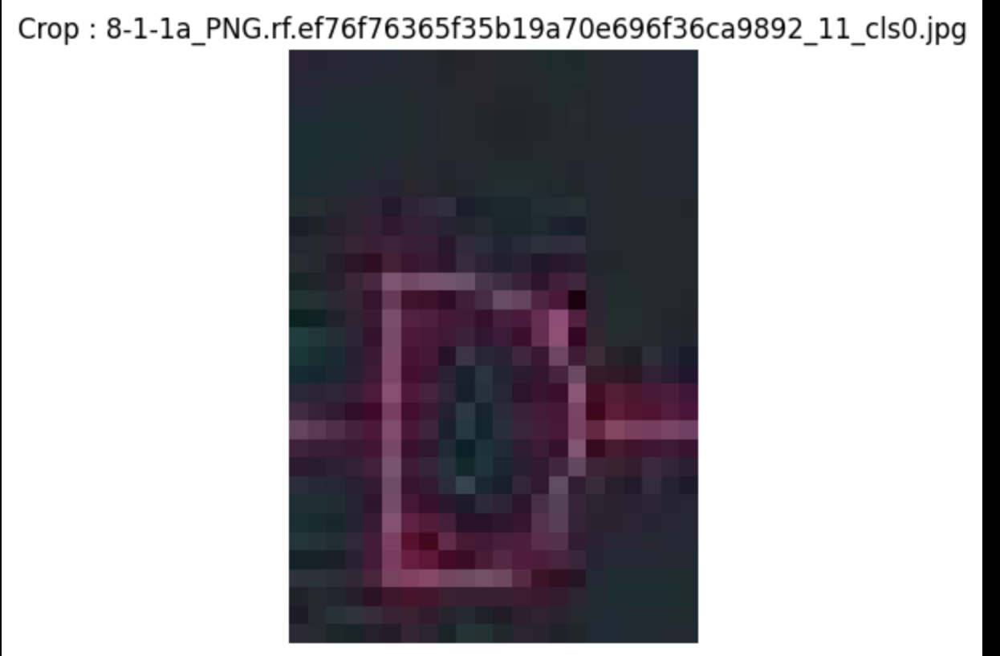
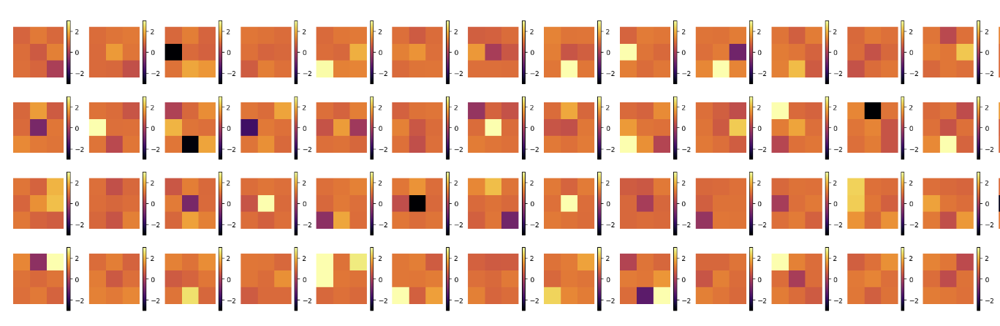

# One-Shot Learning for Plan Symbols using SimCLR

This repository contains a complete Jupyter notebook demonstrating how to train a **SimCLR** model to learn robust feature representations of architectural plan symbols for **one-shot learning**.  
The goal is to obtain a feature extractor capable of recognizing a new unseen symbol from a *single* example.

---

## 📌 Project Overview

The notebook walks through the full pipeline:

### 1. **Dataset Preprocessing**
- Image cleaning and formatting.
- **Automatic cropping** to isolate individual symbols.
- A full SimCLR-style augmentation pipeline:
  - Random resized crops  
  - Color Jitter  
  - Gaussian Blur  
  - Horizontal flips  
  - Normalization  






These augmentations are designed to enforce invariance to contrast, blur, and spatial transformations.


### 2. **Model Architecture**
- Backbone: **ResNet** (18 or 50).
- Added **MLP projection head**, as required by the SimCLR contrastive framework.
- After training, the projection head is discarded and the backbone becomes a **feature extractor** for one-shot learning.

### 3. **Contrastive Loss: NT-Xent (InfoNCE)**
The notebook implements the full SimCLR loss:
- Positive pairs: two augmentations of the same image  
- Negative pairs: all other images in the batch  
- Temperature scaling  
- Normalized dot-product similarity  

### 4. **Training Experiments**

Several configurations were tested:

#### ⭐ Model comparisons
- ResNet50  
- ResNet18 baseline  
- ResNet18 with layer1-3 frozen: best results


#### ⭐ Hyperparameters explored
- Learning rate  
- Weight decay  
- Batch size  
- Scheduler strategies (cosine annealing, warm restarts…)
- Temperature
- Output dimensions

#### 📈 Example Training Curves

> Replace these image paths with your actual plot screenshots.


### 🔍 Weight Change Visualization (Layer 4 Analysis)



- Confirm that **only unfrozen layers** are modified  
- Detect potential training instabilities  
- Assess whether fine-tuning is gentle or overly disruptive


### 5. **One-Shot Evaluation Protocol**
The notebook implements a lightweight evaluation pipeline:

1. Extract embeddings from the trained backbone.  
2. Build a **support set**: one example per class.  
3. For each query image:
   - Compute its embedding
   - Find the nearest support embedding  
   - Assign the support label  

### Example t-SNE Visualization


This gives a qualitative view of how well classes separate in the learned space.

### 6. **Conclusion**
The notebook identifies training configurations that produce strong, contrast-invariant embeddings suitable for one-shot symbol recognition.  
It also highlights limitations and potential future improvements (e.g., larger batch sizes, longer training, stronger augmentations).

---

## 📄 Repository Contents

- `one_shot_simclr.ipynb` — End-to-end notebook including:
  - Data preprocessing pipeline  
  - Model construction  
  - Contrastive learning loop  
  - Evaluation on one-shot classification  

⚠️ **This repository does NOT include:**
- Model weights  
- Datasets  

This keeps the repository lightweight and avoids storing large binaries.

---

## 🚀 Usage

### Install dependencies
```bash
pip install torch torchvision numpy matplotlib scikit-learn
